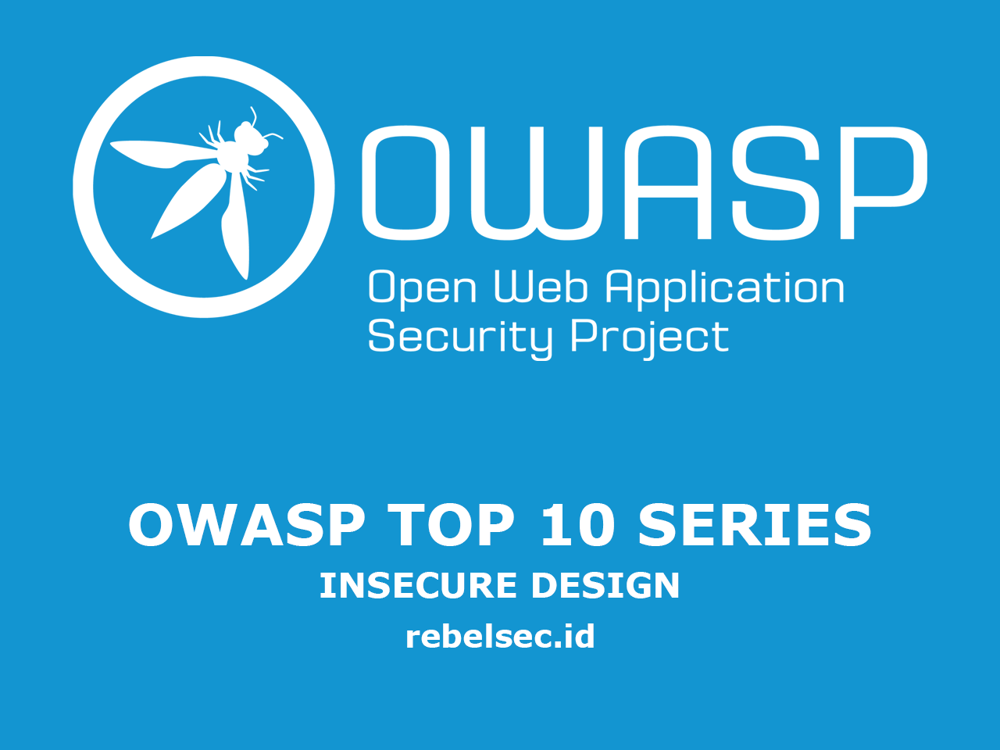

## Pengantar

Artikel kali ini kita akan membahas owasp top 10 yang ada di urutan ke empat untuk tahun 2021 (owasp tiap 4 tahun sekali), ialah **Insecure Design**.

OWASP merupakan singkatan dari _Open Web Application Security Project_, yang merupakan sebuah project _Security Web Application_ open source yang diperkasai oleh para penggiat teknologi atau pengembang aplikasi, OWASP sering mengadakan seminar, forum diskusi serta pendidikan untuk para Developer.

jadi yang dimaksud **OWASP TOP 10**? owasp top 10 merupakan sebuah cara untuk mengkategorikan resiko kerentanan yang sering terjadi pada sebuah aplikasi berbasis website, dari yang paling atas (resiko tertinggi) hingga yang paling bawah (tingkat resiko rendah), Tujuannya apa ?, tentu saja ini sangat berguna bagi para developer aplikasi supaya mereka jadi lebih aware terhadap kerentanan di aplikasi mereka.

## Insecure Design

### Apa itu Insecure Design ?

**Insecure Design** merupakan sebuah kerentanan yang ada pada Konsep / design dari aplikasi itu sendiri. sebelum melakukan koding developer wajib menerapkan prinsip **Secure Coding** pada aplikasi buatannya.

**Insecure Design** ini merupakan kerentanan yang dimana perbaikan nya cukup sulit di perbaiki oleh developer (dikarenakan yang bermasalah itu adalah desain / fondasinya) makanya dibutuhkan waktu yang cukup banyak.

**Insecure Implementation** merupakan kerentanan yang disebabkan dari prinsip **Secure Coding** itu sendiri. dikarenakan developer tidak mengimplementasikan _Sengaja/tidak sengaja_ prinsip dari **Secure Coding**.

## Praktikal

Berikut saya cantumkan beberapa contoh report dari orang lain di celah keamanan **Insecure Design** :

### #1353244 [samokat.ru] PHP modules path disclosure due to lack of error handling

Sumber : https://hackerone.com/reports/1353244

- Attacker menuju url : quality.samokat.ru/info.php, dan mendapati respon **File Not Found**
- kemudian Attacker mengulangi requestnya, lalu ke **Turbo Intruder** yang ada pada Burpsuite
- Payload : /§fuzz§ HTTP/2
- Attacker mendapatkan informasi yang sensitive

Request :

```
GET /§Fuzz§ HTTP/2
Host: quality.samokat.ru
Upgrade-Insecure-Requests: 1
Sec-Fetch-Mode: navigate
Sec-Fetch-User: ?1
Connection: close
```

Response :

```
HTTP/2 500 Internal Server Error
Date: Tue, 28 Sep 2021 07:49:15 GMT
Content-Type: text/html; charset=UTF-8
Cache-Control: no-cache, private
Cf-Cache-Status: DYNAMIC
Expect-Ct: max-age=604800, report-uri="https://report-uri.cloudflare.com/cdn-cgi/beacon/expect-ct"
Server: cloudflare
Cf-Ray: 695b5fbd09a84a1d-SIN


#	CALLED CODE	DOCUMENT	LINE
44	Doctrine\DBAL\Driver\PDOConnection->__construct(…)	~/vendor/laravel/framework/src/Illuminate/Database/Connectors/Connector.php	64
43	Illuminate\Database\Connectors\Connector->createPdoConnection(…)	~/vendor/laravel/framework/src/Illuminate/Database/Connectors/Connector.php	97
42	Illuminate\Database\Connectors\Connector->tryAgainIfCausedByLostConnection(…)	~/vendor/laravel/framework/src/Illuminate/Database/Connectors/Connector.php	47
41	Illuminate\Database\Connectors\Connector->createConnection(…)	~/vendor/laravel/framework/src/Illuminate/Database/Connectors/PostgresConnector.php	33
40	Illuminate\Database\Connectors\PostgresConnector->connect(…)	~/vendor/october/rain/src/Database/Connectors/ConnectionFactory.php	29
39	October\Rain\Database\Connectors\ConnectionFactory->October\Rain\Database\Connectors\{closure}()
38	call_user_func(…)	~/vendor/laravel/framework/src/Illuminate/Database/Connection.php	915
37	Illuminate\Database\Connection->getPdo()	~/vendor/laravel/framework/src/Illuminate/Database/DatabaseManager.php	248
36	Illuminate\Database\DatabaseManager->refreshPdoConnections(…)	~/vendor/laravel/framework/src/Illuminate/Database/DatabaseManager.php	234
35	Illuminate\Database\DatabaseManager->reconnect(…)	~/vendor/laravel/framework/src/Illuminate/Database/DatabaseManager.php	168
34	Illuminate\Database\DatabaseManager->Illuminate\Database\{closure}(…)
33	call_user_func(…)	~/vendor/laravel/framework/src/Illuminate/Database/Connection.php	753
32	Illuminate\Database\Connection->reconnect()	~/vendor/laravel/framework/src/Illuminate/Database/Connection.php	767
31	Illuminate\Database\Connection->reconnectIfMissingConnection()	~/vendor/laravel/framework/src/Illuminate/Database/Connection.php	616
30	Illuminate\Database\Connection->run(…)	~/vendor/laravel/framework/src/Illuminate/Database/Connection.php	333
29	Illuminate\Database\Connection->select(…)	~/vendor/laravel/framework/src/Illuminate/Database/Query/Builder.php	1719
28	Illuminate\Database\Query\Builder->runSelect()	~/vendor/laravel/framework/src/Illuminate/Database/Query/Builder.php	1704
27	Illuminate\Database\Query\Builder->get(…)	~/vendor/october/rain/src/Database/QueryBuilder.php	217
26	October\Rain\Database\QueryBuilder->October\Rain\Database\{closure}()	~/vendor/laravel/framework/src/Illuminate/Cache/Repository.php	323
25	Illuminate\Cache\Repository->remember(…)	~/vendor/laravel/framework/src/Illuminate/Cache/CacheManager.php	304
24	Illuminate\Cache\CacheManager->__call(…)	~/vendor/october/rain/src/Database/QueryBuilder.php	158
23	October\Rain\Database\QueryBuilder->getCached(…)	~/vendor/october/rain/src/Database/QueryBuilder.php	121
22	October\Rain\Database\QueryBuilder->getDuplicateCached(…)	~/vendor/october/rain/src/Database/QueryBuilder.php	92
21	October\Rain\Database\QueryBuilder->get(…)	~/vendor/laravel/framework/src/Illuminate/Database/Eloquent/Builder.php	481
20	Illuminate\Database\Eloquent\Builder->getModels(…)	~/vendor/laravel/framework/src/Illuminate/Database/Eloquent/Builder.php	465
19	Illuminate\Database\Eloquent\Builder->get(…)	~/vendor/laravel/framework/src/Illuminate/Database/Concerns/BuildsQueries.php	77
18	Illuminate\Database\Eloquent\Builder->first()	~/modules/system/behaviors/SettingsModel.php	114
17	System\Behaviors\SettingsModel->getSettingsRecord()	~/modules/system/behaviors/SettingsModel.php	76
16	System\Behaviors\SettingsModel->instance()	~/modules/system/behaviors/SettingsModel.php	135
15	System\Behaviors\SettingsModel->get(…)
14	call_user_func_array(…)	~/vendor/october/rain/src/Extension/ExtendableTrait.php	414
13	October\Rain\Database\Model->extendableCall(…)	~/vendor/october/rain/src/Database/Model.php	647
12	October\Rain\Database\Model->__call(…)	~/vendor/laravel/framework/src/Illuminate/Database/Eloquent/Model.php	1489
11	Illuminate\Database\Eloquent\Model::__callStatic(…)	~/modules/system/models/EventLog.php	37
10	System\Models\EventLog::useLogging()	~/modules/system/ServiceProvider.php	286
9	System\ServiceProvider->System\{closure}(…)
8	call_user_func_array(…)	~/vendor/october/rain/src/Events/Dispatcher.php	233
7	October\Rain\Events\Dispatcher->dispatch(…)	~/vendor/laravel/framework/src/Illuminate/Log/Writer.php	295
6	Illuminate\Log\Writer->fireLogEvent(…)	~/vendor/laravel/framework/src/Illuminate/Log/Writer.php	201
5	Illuminate\Log\Writer->writeLog(…)	~/vendor/laravel/framework/src/Illuminate/Log/Writer.php	114
4	Illuminate\Log\Writer->error(…)	~/vendor/laravel/framework/src/Illuminate/Support/Facades/Facade.php	221
3	Illuminate\Support\Facades\Facade::__callStatic(…)	~/vendor/october/rain/src/Foundation/Exception/Handler.php	66
2	October\Rain\Foundation\Exception\Handler->report(…)	~/vendor/laravel/framework/src/Illuminate/Foundation/Bootstrap/HandleExceptions.php	81
1	Illuminate\Foundation\Bootstrap\HandleExceptions->handleException(…)
```

dari penjelasan di atas attacker mendapatkan informasi sensitif yan ada pada pesan error karena **developer** tidak menggunakan error handler yang baik.

jadi ketika Attacker memasukkan data tidak sesuai dengan data yang aplikasi minta menyebabkan kebocoran informasi.

### #Questions and Aanswers

Menurut NIST 800-63b, the OWASP ASVS, and the OWASP Top 10 **Questions and answers** merupakan _alat_ verifikasi pengguna yang tidak valid.

misalnya kita mempunyai akun **google** seperti berikut :

- name : rebelsec
- username : rebelsec
- password : 123ib12!@#$SAD%&A%SDEWDFAS%^D&
- recovery : siapa nama ibu saya ?

nah jika attacker ingin membajak/mengambil ahli akun dari **rebelsec**, kalau pakai teknik **Bruteforce** kan tidak mungkin, karna passwordnya sudah **sangat aman**.

tapi terdapat kelemahan dari **desain** aplikasi ini, yaitu di **recovery**. attacker tinggal mencari tahu nama ibu dari akun **rebelsec**, yang di zaman sekarang ini mencari informasi seseoran itu cukup mudah, bisa pakai **Osint**, atau teknik lainnya.

## Mitigasi

- Ikuti OWASP top 10
- Menimplementasikan SDLC pada life cycle development, dan tetap lakukan pentesting / konsultasi security aplikasi untuk evaluasi.
- Selalu update sistem/library.
- Menerapkan keamanan bukan hanya di **Aplication layer**, tetapi di layer lain juga, seperti **Network layer**

# Referensi

[OWASP Cheat Sheet: Secure Design Principles](https://cheatsheetseries.owasp.org/cheatsheets/Secure_Product_Design_Cheat_Sheet.html)>

[OWASP SAMM: Design:Security Architecture](https://owaspsamm.org/model/design/security-architecture/)

[OWASP SAMM: Design:Threat Assessment</a> </p](https://owaspsamm.org/model/design/threat-assessment/)

[NIST – Guidelines on Minimum Standards for Developer Verification of Software](https://www.nist.gov/publications/guidelines-minimum-standards-developer-verification-software)

[The Threat Modeling Manifesto](https://threatmodelingmanifesto.org)

[Awesome Threat Modeling](https://github.com/hysnsec/awesome-threat-modelling)

# Beberapa kerentanan lain di list CWE

[CWE-73 External Control of File Name or Path](https://cwe.mitre.org/data/definitions/73.html))

[CWE-183 Permissive List of Allowed Inputs](https://cwe.mitre.org/data/definitions/183.html))

[CWE-209 Generation of Error Message Containing Sensitive Information](https://cwe.mitre.org/data/definitions/209.html))

[CWE-213 Exposure of Sensitive Information Due to Incompatible Policies](https://cwe.mitre.org/data/definitions/213.html))

[CWE-235 Improper Handling of Extra Parameters](https://cwe.mitre.org/data/definitions/235.html))

[CWE-256 Unprotected Storage of Credentials](https://cwe.mitre.org/data/definitions/256.html))

[CWE-257 Storing Passwords in a Recoverable Format](https://cwe.mitre.org/data/definitions/257.html))

[CWE-266 Incorrect Privilege Assignment](https://cwe.mitre.org/data/definitions/266.html))

[CWE-269 Improper Privilege Management](https://cwe.mitre.org/data/definitions/269.html))

[CWE-280 Improper Handling of Insufficient Permissions or Privileges](https://cwe.mitre.org/data/definitions/280.html))

[CWE-311 Missing Encryption of Sensitive Data](https://cwe.mitre.org/data/definitions/311.html))

[CWE-312 Cleartext Storage of Sensitive Information](https://cwe.mitre.org/data/definitions/312.html))

[CWE-313 Cleartext Storage in a File or on Disk](https://cwe.mitre.org/data/definitions/313.html))

[CWE-316 Cleartext Storage of Sensitive Information in Memory](https://cwe.mitre.org/data/definitions/316.html))

[CWE-419 Unprotected Primary Channel](https://cwe.mitre.org/data/definitions/419.html))

[CWE-430 Deployment of Wrong Handler](https://cwe.mitre.org/data/definitions/430.html))

[CWE-434 Unrestricted Upload of File with Dangerous Type](https://cwe.mitre.org/data/definitions/434.html))

[CWE-444 Inconsistent Interpretation of HTTP Requests ('HTTP Request Smuggling')](https://cwe.mitre.org/data/definitions/444.html))

[CWE-451 User Interface (UI) Misrepresentation of Critical Information](https://cwe.mitre.org/data/definitions/451.html))

[CWE-472 External Control of Assumed-Immutable Web Parameter](https://cwe.mitre.org/data/definitions/472.html))

[CWE-501 Trust Boundary Violation](https://cwe.mitre.org/data/definitions/501.html))

[CWE-522 Insufficiently Protected Credentials](https://cwe.mitre.org/data/definitions/522.html))

[CWE-525 Use of Web Browser Cache Containing Sensitive Information](https://cwe.mitre.org/data/definitions/525.html))

[CWE-539 Use of Persistent Cookies Containing Sensitive Information](https://cwe.mitre.org/data/definitions/539.html))

[CWE-579 J2EE Bad Practices: Non-serializable Object Stored in Session](https://cwe.mitre.org/data/definitions/579.html))

[CWE-598 Use of GET Request Method With Sensitive Query Strings](https://cwe.mitre.org/data/definitions/598.html))

[CWE-602 Client-Side Enforcement of Server-Side Security](https://cwe.mitre.org/data/definitions/602.html))

[CWE-642 External Control of Critical State Data](https://cwe.mitre.org/data/definitions/642.html))

[CWE-646 Reliance on File Name or Extension of Externally-Supplied File](https://cwe.mitre.org/data/definitions/646.html))

[CWE-650 Trusting HTTP Permission Methods on the Server Side](https://cwe.mitre.org/data/definitions/650.html))

[CWE-653 Insufficient Compartmentalization](https://cwe.mitre.org/data/definitions/653.html))

[CWE-656 Reliance on Security Through Obscurity](https://cwe.mitre.org/data/definitions/656.html))

[CWE-657 Violation of Secure Design Principles](https://cwe.mitre.org/data/definitions/657.html))

[CWE-799 Improper Control of Interaction Frequency](https://cwe.mitre.org/data/definitions/799.html))

[CWE-807 Reliance on Untrusted Inputs in a Security Decision](https://cwe.mitre.org/data/definitions/807.html))

[CWE-840 Business Logic Errors](https://cwe.mitre.org/data/definitions/840.html))

[CWE-841 Improper Enforcement of Behavioral Workflow](https://cwe.mitre.org/data/definitions/841.html))

[CWE-927 Use of Implicit Intent for Sensitive Communication](https://cwe.mitre.org/data/definitions/927.html))

[CWE-1021 Improper Restriction of Rendered UI Layers or Frames](https://cwe.mitre.org/data/definitions/1021.html))

[CWE-1173 Improper Use of Validation Framework](https://cwe.mitre.org/data/definitions/1173.html))
