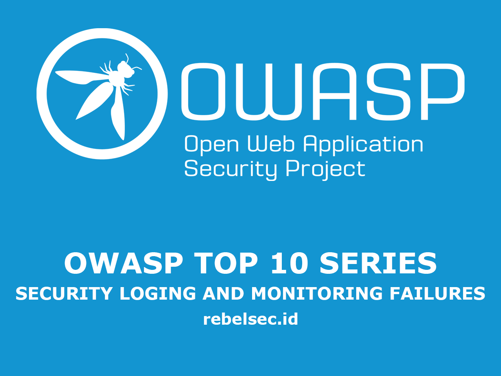

## Pengantar

Artikel kali ini kita akan membahas owasp top 10 yang ada di urutan ke sembilan untuk tahun 2021 (owasp tiap 4 tahun sekali), ialah **Security Loging and Monitoring Failures**.

OWASP merupakan singkatan dari _Open Web Application Security Project_, yang merupakan sebuah project _Security Web Application_ open source yang diperkasai oleh para penggiat teknologi atau pengembang aplikasi, OWASP sering mengadakan seminar, forum diskusi serta pendidikan untuk para Developer.

jadi yang dimaksud **OWASP TOP 10**? owasp top 10 merupakan sebuah cara untuk mengkategorikan resiko kerentanan yang sering terjadi pada sebuah aplikasi berbasis website, dari yang paling atas (resiko tertinggi) hingga yang paling bawah (tingkat resiko rendah), Tujuannya apa ?, tentu saja ini sangat berguna bagi para developer aplikasi supaya mereka jadi lebih aware terhadap kerentanan di aplikasi mereka.

## Security Loging and Monitoring Failures

### Apa itu Security Loging and Monitoring Failures ?

**Security Loging and Monitoring Failures** Merupakan suatu kondisi yang dimana aplikasi tidak dapat dimonitoring dengan baik oleh developer aplikasi itu sendiri, penyebabnya biasanya ada di **Log Management**, atau mungkin **Human Error**

di kerentanan ini sangat minim akan CVE/CVSS yang ada, tapi kerentanan ini merupakan kerentanan yang **critical**, karena dapat membahayakan client.

- CWE-778 Insufficient Logging by pairing CWE-117 Neutralization Output Improper for Logs
- CWE-223 Omission of Security-relevant Information
- CWE-532 Insertion of Sensitive Information into Log File.

## Praktikel

### #775504 Exposed debug.log file leads to information disclosure

sumber : https://hackerone.com/reports/775504

attacker menemukan sebuah file **debug.log** di sebuah aplikasi yang mana isinya terdapat informasi sensitive termasuk **username** dll

http://mariadb.org/wp-content/debug.log

### #503283 Real Time Error Logs Through Debug Information

sumber : https://hackerone.com/reports/503283

di kasus kali ini attacker mendapatkan beberapa sensitif data seperti :

- User Device Information
- Redacted Token
- Client IP Address
- Description
- Session ID
- Team ID
- User ID
- User Agent
- Server Response
- Timestamp
- api_call
- x-amz-cf-id
- x-amz-id-2
- And other user sensitive information.

attacker hanya perlu **me-refresh** browser dan melihat **Real Time** log.

https://slackb.com/debug

### #60058 teach.udemy.com log poison vulnerability through wordpress debug.log being publically available

sumber : https://hackerone.com/reports/60058

atacker menemukan sebuah **log file** di domain **teach.udemy.com** yang nama filenya _debug.log_ yang bisa diakses public dan kurang lebih _1gb_.

## Mitigasi

- pastikan semua login error, akses kontrol dan validasi dari _Server side_ dapat terbaca dengan baik, untuk memudahkan dalam melakukan pengecekan **identify suspicious** atau **malicious accounts**
- gunakan format yang mudah di baca
- menggikuti referensi dari **NIST 800-61r2** atau lainnya
- _DevSecOps_ senantiasa melakukan monitoring aplikasi/website

## Referensi

[OWASP OWASP Proactive Controls proactive control: Implement Recording and Monitoring](https://owasp.org/www-project-proactive-controls/v3/en/c9-security-logging.html)

[OWASP security verification standart: Recording V8 and Monitoring](https://owasp.org/www-project-application-security-verification-standard)

[OWASP Guide to conducting Tests: Tests for Error codes that are petite](https://owasp.org/www-project-web-security-testing-guide/v41/4-Web_Application_Security_Testing/08-Testing_for_Error_Handling/01-Testing_for_Error_Code)

[OWASP Cheat Sheet: Logging](https://cheatsheetseries.owasp.org/cheatsheets/Logging_Cheat_Sheet.html)

[Data Integrity: Recovery from ransomware and events destructive](https://csrc.nist.gov/publications/detail/sp/1800-11/final)

[Data Integrity: Identify and protect the assets from ransomware and destructive events the other](https://csrc.nist.gov/publications/detail/sp/1800-25/final)

[Data Integrity: Detect and Respond to ransomware and events other destructive](https://csrc.nist.gov/publications/detail/sp/1800-26/final)

## Beberapa Kerentanan lain di list CWE

CWE-117 Neutralization Output Improper for Logs

CWE-223 Omission of Security-relevant Information

CWE-532 Insertion of Sensitive Information into Log File

CWE-778 Insufficient Logging
