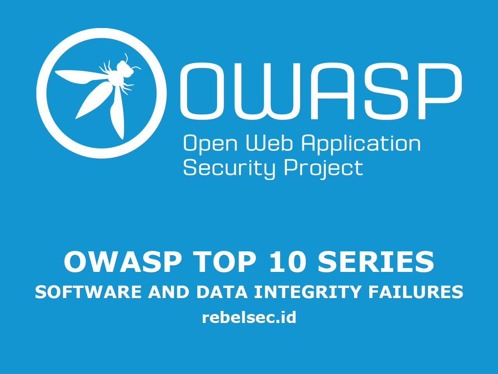

## Introduction

In this article, we will discuss the eighth item in the OWASP Top 10 for 2021 (OWASP releases a new list every four years), which is **Software and Data Integrity Failures**.

OWASP, short for the *Open Web Application Security Project*, is an open-source initiative focused on improving the security of web applications. The organization regularly conducts seminars, discussions, and educational programs for developers and security professionals.

So, what is the **OWASP Top 10**?  
It is a classification of the most critical security risks commonly found in web applications, ranked from the highest to the lowest severity. Its primary purpose is to help developers better understand and mitigate these risks in the systems they build.

---

## Software and Data Integrity Failures

### What Are Software and Data Integrity Failures?

**Software and Data Integrity Failures** refer to weaknesses in an application that arise when the system does not properly validate the integrity of software or data being used.

This category includes vulnerabilities such as:

- **CWE-829**: Inclusion of Functionality from Untrusted Control Sphere  
- **CWE-494**: Download of Code Without Integrity Check  
- **CWE-502**: Deserialization of Untrusted Data  

These failures often occur because the application, environment, or infrastructure does not adequately prevent unauthorized modifications. Examples include:

- Serialized objects or data structures that can be viewed or manipulated by attackers, making them vulnerable to insecure deserialization.
- Applications that rely on plugins, libraries, or modules from untrusted sources (repositories, mirrors, or CDNs).
- Insecure CI/CD pipelines that may allow unauthorized access, malicious code injection, or system compromise.
- Automated update mechanisms that download updates without verifying their integrity — enabling attackers to distribute malicious updates across all installations.

---

## Practical

### A08:2021 – Software and Data Integrity Failures — Explained



---

## Mitigation

- Use signatures, checksums, or integrity verification mechanisms before executing or installing software components.
- Ensure that all libraries, dependencies, and plugins originate from trusted and verified sources.
- Implement allowlists for third-party software sources.
- Secure CI/CD pipelines with strict access controls and artifact validation.
- Prefer software packages, images, or binaries that include official hash verification.

---

## References

- [OWASP Cheat Sheet: Infrastructure as Code](https://cheatsheetseries.owasp.org/cheatsheets/Infrastructure_as_Code_Security_Cheat_Sheet.html)  
- [OWASP Cheat Sheet: Deserialization](https://www.owasp.org/index.php/Deserialization_Cheat_Sheet)  
- [SAFECode Software Integrity Controls](https://safecode.org/publication/SAFECode_Software_Integrity_Controls0610.pdf)  
- [A 'Worst Nightmare' Cyberattack: The SolarWinds Hack](https://www.npr.org/2021/04/16/985439655/a-worst-nightmare-cyberattack-the-untold-story-of-the-solarwinds-hack)  
- [CodeCov Bash Uploader Compromise](https://about.codecov.io/security-update)  
- [Securing DevOps — Julien Vehent](https://www.manning.com/books/securing-devops)

---

## Additional Related CWE Entries

[CWE-345 Insufficient Verification of Data Authenticity](https://cwe.mitre.org/data/definitions/345.html)

[CWE-353 Missing Support for Integrity Check](https://cwe.mitre.org/data/definitions/353.html)

[CWE-426 Untrusted Search Path](https://cwe.mitre.org/data/definitions/426.html)

[CWE-494 Download of Code Without Integrity Check](https://cwe.mitre.org/data/definitions/494.html)

[CWE-502 Deserialization of Untrusted Data](https://cwe.mitre.org/data/definitions/502.html)

[CWE-565 Reliance on Cookies without Validation and Integrity Checking](https://cwe.mitre.org/data/definitions/565.html)

[CWE-784 Reliance on Cookies without Validation and Integrity Checking in a Security Decision](https://cwe.mitre.org/data/definitions/784.html)

[CWE-829 Inclusion of Functionality from Untrusted Control Sphere](https://cwe.mitre.org/data/definitions/829.html)

[CWE-830 Inclusion of Web Functionality from an Untrusted Source](https://cwe.mitre.org/data/definitions/830.html)

[CWE-915 Improperly Controlled Modification of Dynamically-Determined Object Attributes](https://cwe.mitre.org/data/definitions/915.html)
