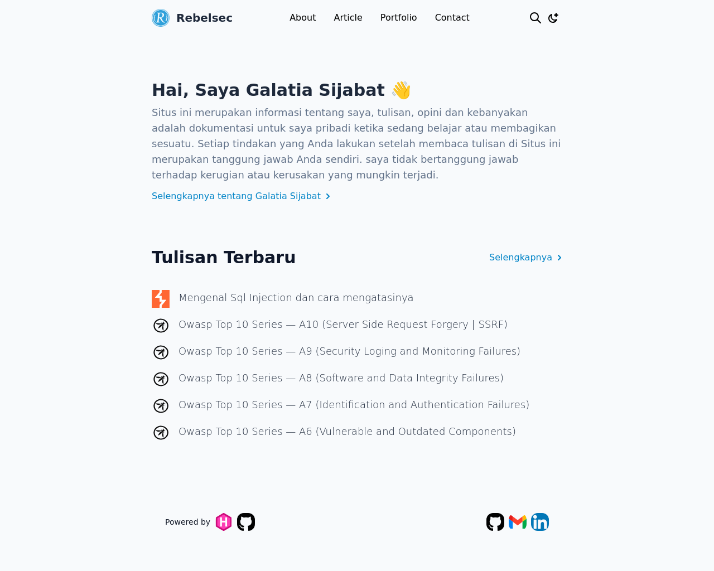
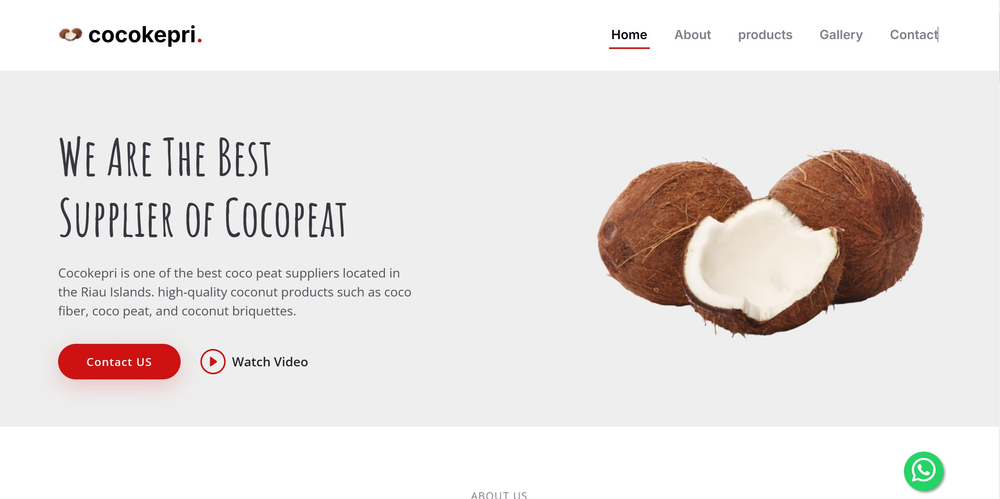

A curated list of projects I've worked on. Interested in collaborating on a related project? [Get in touch!](/contact)

## Web Apps

### NgeBlog - Hugo Template

NgeBlog is an open-source project by RebelSec, designed to simplify self-hosted blogging. It provides a lightweight, customizable, and secure blogging platform, making it easy for users to publish and manage content efficiently.

[GitHub Repository](https://github.com/rebelsec/NgeBlog)

### Cocokepri.com

A website providing information on cocopeat products, including benefits, usage, and pricing. Built with HTML, CSS, and JavaScript, it features a responsive design for easy navigation on all devices. Hosted on GitHub for easy access and management.

[GitHub Repository](https://github.com/rebelsec/cocokepri)
